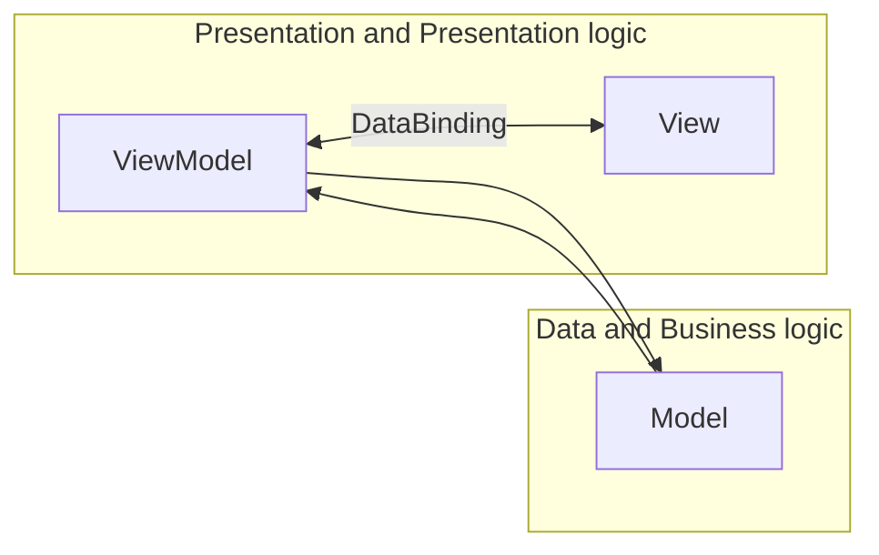
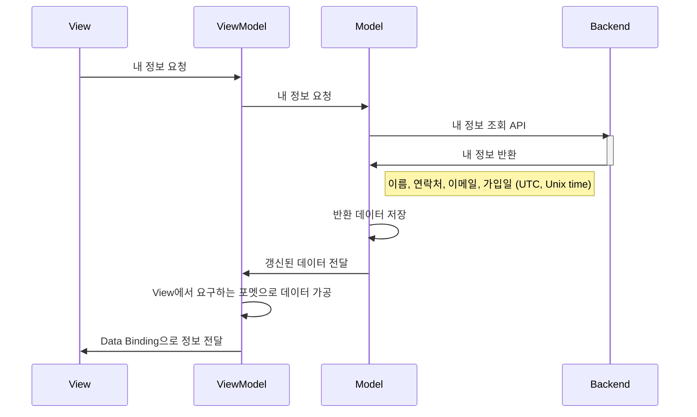
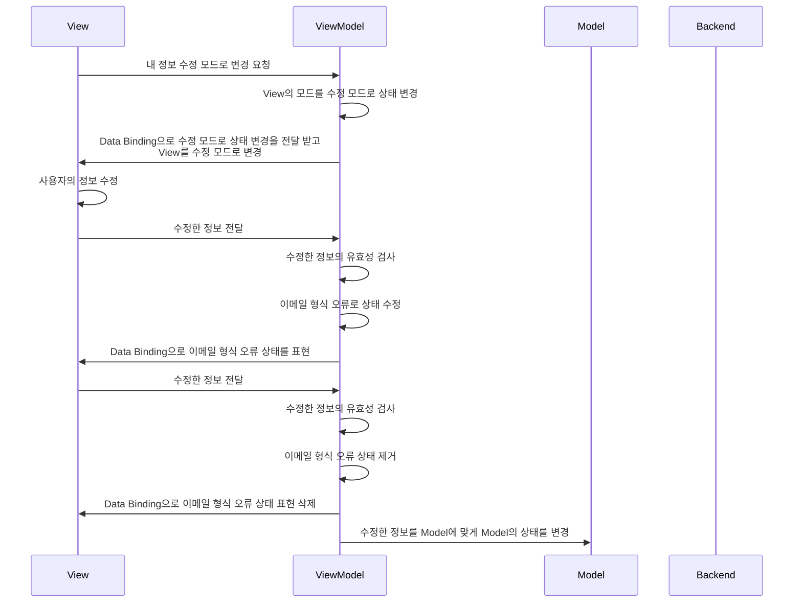
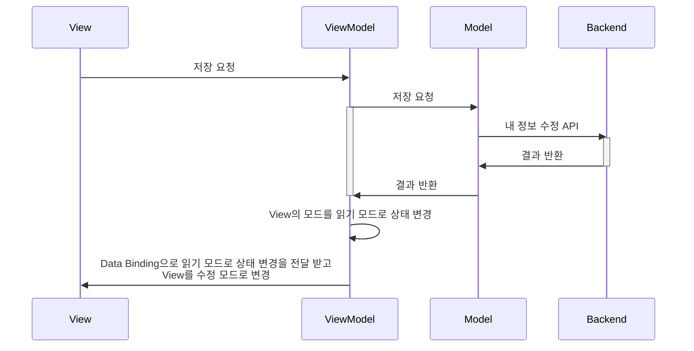

디자인 패턴중 MVVM 패턴의 MVVM은 Model, View, ViewModel의 첫글자로 구성된 용어이며 각각의 역할을 수행하여 비즈니스 로직과 프레젠테이션 로직을 분리하는 것을 목표로 한다

- MVVM 디자인 패턴 - [https://ko.wikipedia.org/wiki/모델-뷰-뷰모델](https://ko.wikipedia.org/wiki/%EB%AA%A8%EB%8D%B8-%EB%B7%B0-%EB%B7%B0%EB%AA%A8%EB%8D%B8)
- 프레젠테이션 로직 - [https://en.wikipedia.org/wiki/Business_logic](https://en.wikipedia.org/wiki/Business_logic)
- 비즈니스 로직 - [https://en.wikipedia.org/wiki/Presentation_logic](https://en.wikipedia.org/wiki/Presentation_logic)
- 
## Model, View, ViewModel 기본 개녕

MVVM 패턴은 MVC 패턴에서 추구하는 비즈니스 로직과 프레젠테이션 로직의 분리를 더욱 효율적으로 하기 위한 디자인 패턴이다

`내 정보 조회 및 수정 기능`에 대한 frontend 개발 환경으로 예를 들어 설명한다

`내 정보`는 이름, 연락처, 이메일, 가입일을 포함한다

### Model

사용자 인터페이스에 종속되지 않은 실제 데이터를 가지고 있으며, 해당 데이터를 변경하거나 REST API 호출 등의 비즈니스 로직을 담당한다

backend으로부터 내 정보를 조회 할 수 있는 비즈니스 로직과 조회한 내 정보인 이름, 연락처, 이메일, 가입일 정보를 가지고 있고 지금 가지고 있는 내 정보를 backend에 수정 요청 할 수 있는 비즈니스 로직을 가지고 있다

### View

사용자 인터페이스로 사용자에게 특정 정보를 표시하거나 정보를 수정 할 수 있게 사용자와 상호 작용한다

내 정보인 이름, 연락처, 이메일, 가입일을 표시하거나, 정보를 수정 할 수 있도록 button 및 input 요소를 제공한다

### ViewModel

view와 model 사이에서 model의 데이터를 view에 맞추어서 model이 가지고 있는 상태 또는 데이터를 view에 올바르게 표시 할 수 있게 하거나 사용자가 view를 통하여 model에 접근하는 것을 돕는다

view에서 내 정보 조회 비즈니스 로직이 완료 된 후에 내 정보가 갱신되는 경우 view에 내 정보가 나타날 수 있도록 정보를 세팅한다

내 정보를 수정 하기 위하여 view에서 수정 버튼을 선택한 경우 view가 내 정보 수정 상태로 표시 될 수 있게 하며, 이름을 공백으로 지정 할 수 없다는 규칙이 있다면 이름 input의 이름을 모두 지우는 경우 이름 input 근처에 오류 메시지 처리를 하거나 저장 버튼을 비활성화 처리하는 프레젠테이션 로직이 포함된다 

## MVVM 패턴의 동작 과정

### 내 정보 페이지 접근

사용자가 View에 접근하면 View는 ViweModel에게 View에서 표현 해야 하는 정보를 요청한다

정보 요청을 받게된 ViewModel은 Model에게 내 정보 조회를 요청하게 되고 Model은 backend에 내 정보를 요청하고 반환받은 결과를 Model에 저장한다  
backend로부터 반환 받은 내 정보의 연락처는 '-'가 없는 숫자로만 구성된 문자열이며, 가입일은 UTC 기준의 Unix time이다

Model의 정보가 갱신 된다면 ViewModel은 View에서 표현 할 수 있도록 정보를 가공하여 ViewModel에 저장한다  
View에서는 연락처를 표시할 때 '-' 문자를 포함하여 표현하며, 가입일을 대한민국 표준시 기준으로 yyyy년 MM월 dd일로 표현하기 위해서 Model에서 저장 하고 있는 연락처와 가입일을 가공하여 ViewModel 저장한다

ViewModel에서 갱신되는 정보는 Data Binding을 이용하여 갱신된 정보가 View에 반영된다

### 내 정보 수정

사용자는 정보를 수정하기 위해서 View에 존재하는 '수정' 버튼을 눌러 페이지를 수정 모드로 변경 해야 하는 유저 시나리오를 가진다고 가정한다

사용자는 View의 '수정' 버튼을 누르게 되면 View는 ViewModel에게 사용자가 페이지의 모드를 수정 모드로 변경 요청을 하였다는 정보를 전달한다  
ViewModel은 View 페이지 모드에 대한 상태 값을 읽기에서 수정으로 변경하여 저장한다

ViewModel에서 갱신되는 정보는 Data Binding을 이용하여 갱신된 정보가 View에 반영되어 View에서 이름과 가입일을 제외한 연락처와 이메일 항목을 수정할 수 있도록 View가 변경된다

### 내 정보 수정 후 저장

사용자는 수정 모드인 내 정보 페이지에서 수정 가능한 연락처와 이메일을 이전과 다른 값으로 변경 한다

View에서는 사용자에 의해서 정보가 변경 된것을 감지하고 ViewModel에게 변경된 값을 Data binding으로 전달한다

ViewModel은 사용자가 변경한 연락처와 이메일에 대해서 올바른 데이터인지 유효성 검사를 진행하고 이메일 정보가 이메일 형식에 맞지 않는 경우에는 ViewModel에 이메일 정보가 유효하지 않는다는 상태값을 설정한다

ViewModel에서 갱신된 정보는 Data Binding을 이용하여 이메일 형식이 올바르지 않다면 View의 이메일 입력 영역에 오류 메세지를 표현하거나 저장 버튼을 비활성화 하여 사용자가 올바른 형식의 이메일을 입력 할 수 있도록 유도한다

사용자의 입력 정보가 모두 유효하여 View의 저장 버튼이 활성화 되고 사용자가 저장 버튼을 눌러 정보 저장 요청을 하겠다는 정보를 ViewModel에게 전달 한다

정보 저장 요청을 전달 받은 ViewModel은 ViewModel에 저장하고 있는 정보중 연락처를 Model에서 요구하는 형식에 맞게 '-'를 제거 하여 Model에 전달하고 Model에게 저장 요청한다

Model은 Backend에게 갱신할 정보를 전달하여 내 정보를 저장 요청 한다
