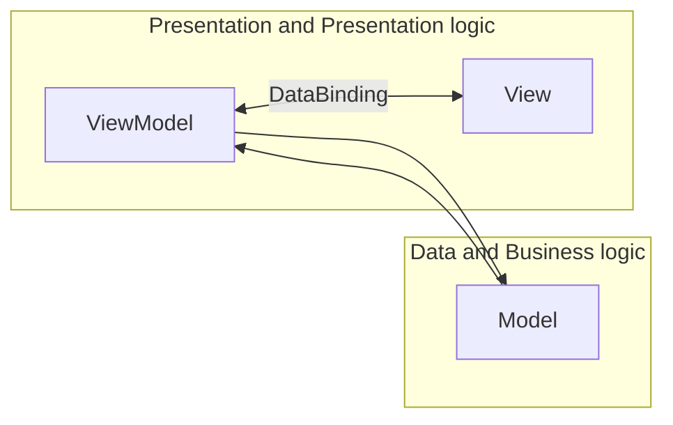

디자인 패턴중 MVVM 패턴의 MVVM은 Model, View, ViewModel의 첫글자로 구성된 용어이며 각각의 역할을 수행하여 비즈니스 로직과 프레젠테이션 로직을 분리하는 것을 목표로 한다

- MVVM 디자인 패턴 - [https://ko.wikipedia.org/wiki/모델-뷰-뷰모델](https://ko.wikipedia.org/wiki/%EB%AA%A8%EB%8D%B8-%EB%B7%B0-%EB%B7%B0%EB%AA%A8%EB%8D%B8)
- 프레젠테이션 로직 - [https://en.wikipedia.org/wiki/Business_logic](https://en.wikipedia.org/wiki/Business_logic)
- 비즈니스 로직 - [https://en.wikipedia.org/wiki/Presentation_logic](https://en.wikipedia.org/wiki/Presentation_logic)

## Model, View, ViewModel

MVVM 패턴은 MVC 패턴에서 추구하는 비즈니스 로직과 프레젠테이션 로직의 분리를 더욱 효율적으로 하기 위한 디자인 패턴이다

`내 정보 조회 및 수정 기능`에 대한 frontend 개발 환경으로 예를 들어 설명한다

### Model

사용자 인터페이스에 종속되지 않은 실제 데이터를 가지고 있으며, 해당 데이터를 변경하거나 REST API 호출 등의 비즈니스 로직을 담당한다

backend으로부터 내 정보를 조회 할 수 있는 비즈니스 로직과 조회한 내 정보인 이름, 연락처, 이메일 정보를 가지고 있고 지금 가지고 있는 내 정보를 backend에 수정 요청 할 수 있는 비즈니스 로직을 가지고 있다

### View

사용자 인터페이스로 사용자에게 특정 정보를 표시하거나 정보를 수정 할 수 있게 사용자와 상호 작용한다

내 정보인 이름, 연락처, 이메일을 표시하거나, 정보를 수정 할 수 있도록 button 및 input 요소를 제공한다

### ViewModel

view와 model 사이에서 model의 데이터를 view에 맞추어서 model이 가지고 있는 상태 또는 데이터를 view에 올바르게 표시 할 수 있게 하거나 사용자가 view를 통하여 model에 접근하는 것을 돕는다

view에서 내 정보 조회 비즈니스 로직이 완료 된 후에 내 정보가 갱신되는 경우 view에 내 정보가 나타날 수 있도록 정보를 세팅한다

내 정보를 수정 하기 위하여 view에서 수정 버튼을 선택한 경우 view가 내 정보 수정 상태로 표시 될 수 있게 하며, 이름을 공백으로 지정 할 수 없다는 규칙이 있다면 이름 input의 이름을 모두 지우는 경우 이름 input 근처에 오류 메시지 처리를 하거나 저장 버튼을 비활성화 처리하는 프레젠테이션 로직이 포함된다 
